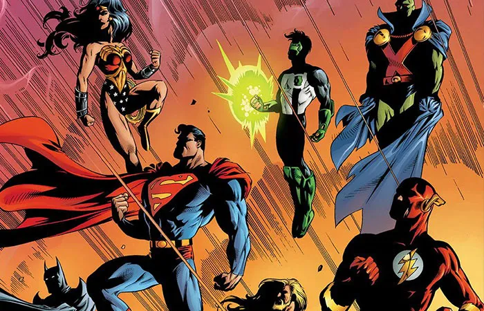

### SEIR 0911EC

# Heroes and Villians Express API

## Introduction

As we saw in unit 1, not all API's are created equally. Before we begin our group full stack project tomorrow, lets take some practice in building up an API from scratch using Mongo, Mongoose, and Express.

In our API we are going to create two models, Heroes and Villains. Each model should have key/value pairs about their respective data (alias/real name, species, powers, weaknesses, affiliations, age, weight, and height...). Each of these models should have a respective Index and Show route for them, and a controller attached to view their data.

## Requirements

- A functioning API with at least 2 models (Heroes and Villains) with at least 4 properties for each. You should be using at least 3 datatypes (Strings, Numbers, Booleans) in each. You can nest other data types (objects or arrays) in in if you would like as well
- Index and Show routes for both models and their entries available on your localhost
-  A Create, Update, or Delete route for each model
  

## Stretch Goals
- Image file upload for each
- Relational data for a 3rd or 4th model - Affiliations or Teams - such as the Justice League, X-Men, Avengers, or any others that you would like to use
- Full CRUD across each model on the back end
